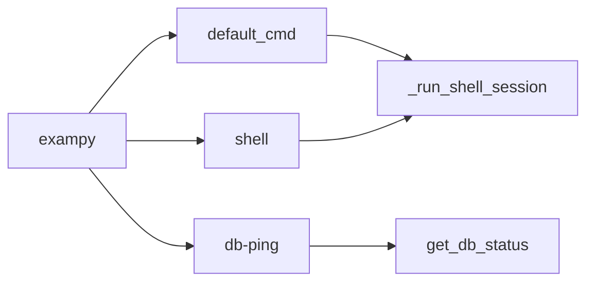
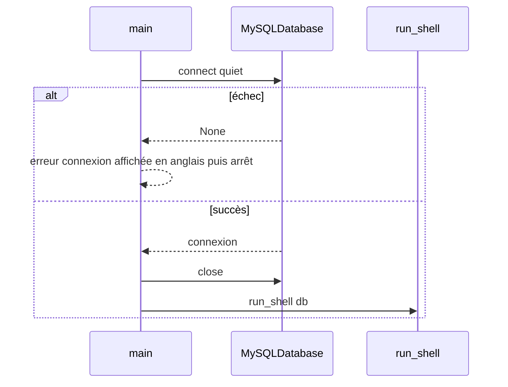

# CLI Cyclopts

L’entrée du programme est **`main.py`**. Elle instancie une application **`cyclopts.App`** nommée `exampy`. Les textes d’aide Cyclopts et les messages console associés sont en **anglais**, y compris lors d’un échec de connexion avant l’ouverture du shell.

## Commandes



| Invocation | Comportement |
|------------|----------------|
| `exampy` | Commande par défaut : vérifie une connexion MySQL puis lance le **shell** en appelant `run_shell`. |
| `exampy shell` | Identique à la ligne précédente. |
| `exampy db-ping` | Affiche la version du serveur MySQL sans ouvrir le REPL. |

## Séquence avant le shell



## Script d’entrée

Défini dans `pyproject.toml` :

```toml
[project.scripts]
exampy = "main:main"
```

Après `uv sync`, la commande **`uv run exampy`** est disponible.
