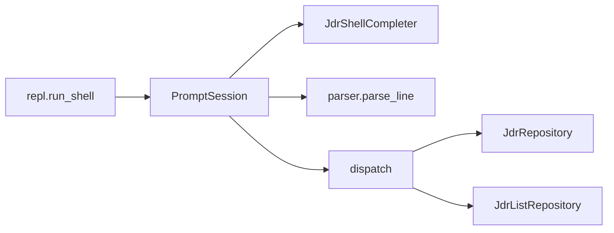
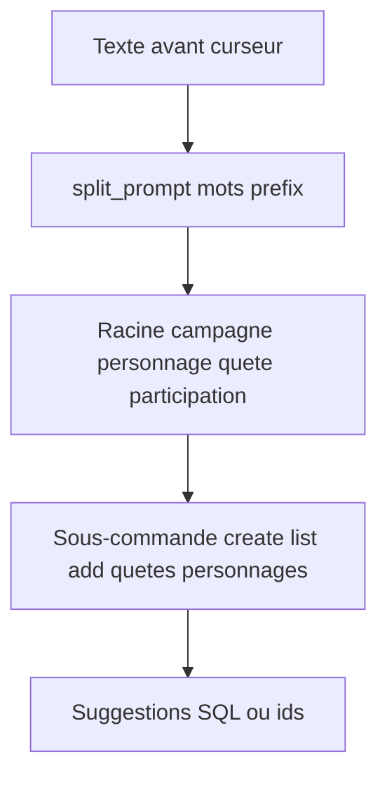

# Shell interactif

## Composants

- **`repl.py`** : boucle infinie, invite `jdr>`, historique dans `~/.cache/exampy/shell_history`.
- **`parser.py`** : découpe une ligne avec **`shlex.split`** (guillemets).
- **`commands.py`** : branchement sur les tokens ; affichage des listes avec **tabulate**.
- **`completer.py`** : complétion **Tab** (`prompt_toolkit`) selon le contexte (sous-commandes, valeurs en base).

## Commandes d’écriture

| Syntaxe | Action |
|---------|--------|
| `campagne create <nom> <maitre_du_jeu>` | Insère une campagne |
| `personnage add <nom> <classe> <niveau> <points_de_vie> <id_campagne>` | Insère un personnage |
| `quete create <titre> <description> <statut> <id_campagne>` | Insère une quête |
| `participation add <id_personnage> <id_quete>` | Inscription à une quête |

## Commandes de liste

| Syntaxe | Source dépôt |
|---------|----------------|
| `campagne list` | `list_toutes_campagnes` |
| `personnage list <id_campagne>` | `list_personnages_par_campagne` |
| `quete list <id_campagne>` | `list_quetes_par_campagne` |
| `quete personnages <id_quete>` | `list_personnages_par_quete` |
| `personnage quetes <id_personnage>` | `list_quetes_par_personnage` |

## Complétion

La ligne est découpée sur les **espaces** (hors guillemets dans la logique de complétion) : pour des libellés avec espaces, utilisez des **guillemets** comme pour l’exécution réelle.

## Raccourcis

- **`help`** — aide intégrée.
- **`exit`** / **`quit`** — quitter le shell.
- **Ctrl+D** — fin de flux (équivalent sortie).
- **Ctrl+C** — nouvelle invite sans quitter.
