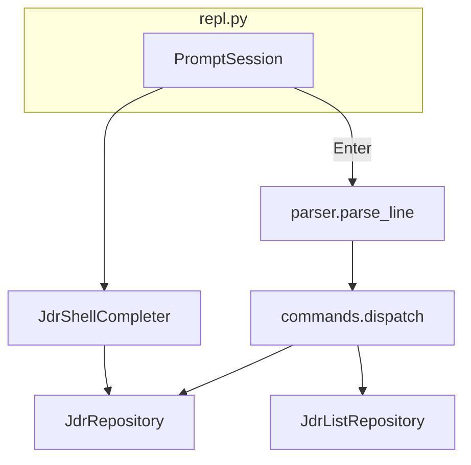
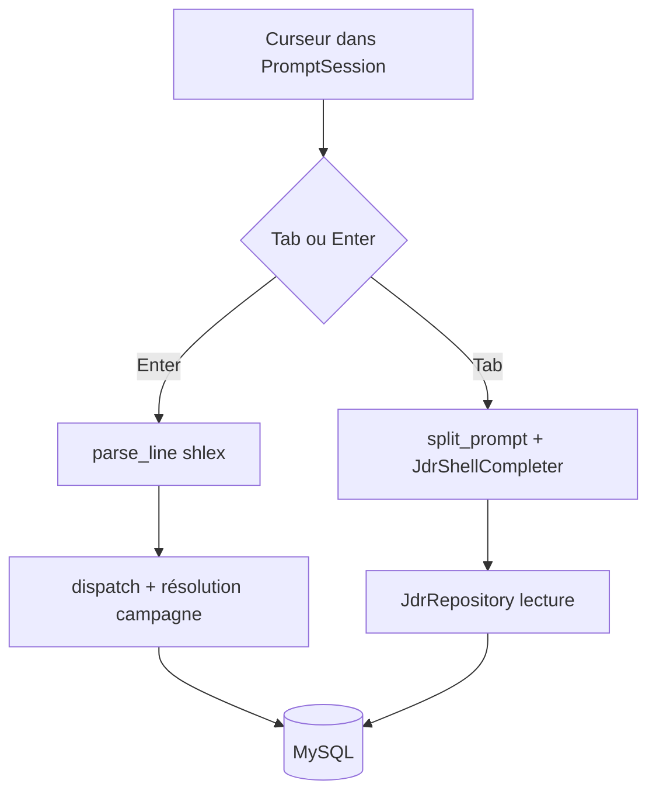

# Shell interactif

## Composants



- **`repl.py`** : boucle infinie, invite `jdr>`, historique dans `~/.cache/exampy/shell_history`. La bannière d’accueil est en anglais.
- **`parser.py`** : découpe une ligne avec **`shlex.split`**, en respectant les guillemets shell. Les messages d’erreur de parsing sont en anglais.
- **`commands.py`** : branchement sur les tokens ; affichage des listes avec **tabulate** ; texte d’aide `help` et messages d’erreur en anglais ; **invites interactives** pour les arguments manquants ; **résolution campagne** par nom ou par identifiant numérique.
- **`completer.py`** : complétion **Tab** via **`prompt_toolkit`** selon le contexte — sous-commandes, noms issus de la base, noms de campagne pour les arguments concernés.

## Langue de l’interface

Toutes les chaînes visibles par l’utilisateur dans le shell — aide, usages, erreurs, invites `input` — sont en **anglais**. Les **libellés métier** stockés en base — noms de campagne, classes, statuts de quête, etc. — restent ceux saisis ou présents en MySQL.

## Invites pour arguments manquants

Si une commande est reconnue mais **incomplète**, le shell demande les valeurs manquantes sur `stdin`, sur le modèle des **paramètres obligatoires** sous PowerShell : chaînes non vides, entiers avec re-saisie tant que la valeur n’est pas un entier valide.

## Référence des campagnes : nom plutôt qu’id

Pour **`character list`**, **`quest list`**, **`character add`** et **`quest create`**, le dernier argument qui cible une campagne accepte :

1. **Un identifiant numérique** tel que `123`, utile pour les scripts ou les bases aux noms ambigus ;
2. **Le nom exact de la campagne** tel qu’enregistré en base, avec correspondance **stricte** sur la colonne `nom`.

Le schéma SQL impose **`UNIQUE (nom, maitre_du_jeu)`** : plusieurs campagnes peuvent partager le **même nom** avec des maîtres du jeu différents. En cas d’**ambiguïté**, le shell affiche les options et demande soit un **numéro de choix**, soit le **nom du dungeon master**, comparé au MJ sans tenir compte de la casse.

La résolution nom → `id_campagne` est implémentée dans le shell par la fonction **`_resolve_campagne_id`**, qui s’appuie sur **`JdrRepository.find_campagnes_by_nom_exact`**. Les dépôts de liste continuent d’interroger MySQL par **`id_campagne`**.

## Commandes d’écriture

| Syntaxe | Action |
|---------|--------|
| `campaign create <name> <dungeon_master>` | Insère une campagne |
| `character add <name> <class> <level> <hit_points> <campaign_name>` | Insère un personnage |
| `quest create <title> <description> <status> <campaign_name>` | Insère une quête |
| `participation add <character_id> <quest_id>` | Inscription à une quête |

Exemple avec espaces dans les libellés :

```text
campaign create "The Mines" "Alice"
quest create "First quest" "Go north." open "World"
```

## Commandes de liste

| Syntaxe | Source dépôt |
|---------|----------------|
| `campaign list` | `list_toutes_campagnes` |
| `character list <campaign_name>` | `list_personnages_par_campagne` |
| `quest list <campaign_name>` | `list_quetes_par_campagne` |
| `quest characters <quest_id>` | `list_personnages_par_quete` |
| `character quests <character_id>` | `list_quetes_par_personnage` |

## Complétion

La logique de complétion découpe sur les **espaces** sans interpréter les guillemets comme le ferait `shlex` à l’exécution : pour des libellés avec espaces, utilisez des **guillemets** comme pour l’exécution réelle.

Pour les arguments **campagne**, la complétion propose les **noms** en les insérant au format shell via **`shlex.quote`**. Si le préfixe tapé ne contient que des **chiffres**, la complétion propose des **identifiants** de campagne ; la méta-description affiche le nom et le maître du jeu.



Les racines reconnues par le compléteur et le dispatch sont notamment `campaign`, `character`, `quest` et `participation`, avec les sous-commandes décrites dans la section **Commandes** ci-dessus.

## Raccourcis

- **`help`** — aide intégrée en anglais.
- **`clear`** — efface l’écran du terminal sans quitter le shell.
- **`exit`** / **`quit`** — quitter le shell.
- **Ctrl+D** — fin de flux, équivalent à une sortie.
- **Ctrl+C** — interrompt la saisie de la ligne principale après **`session.prompt`** et affiche une nouvelle invite ; lors d’invites interactives déclenchées par **`dispatch`**, le comportement peut quitter le shell selon le contexte du terminal.
