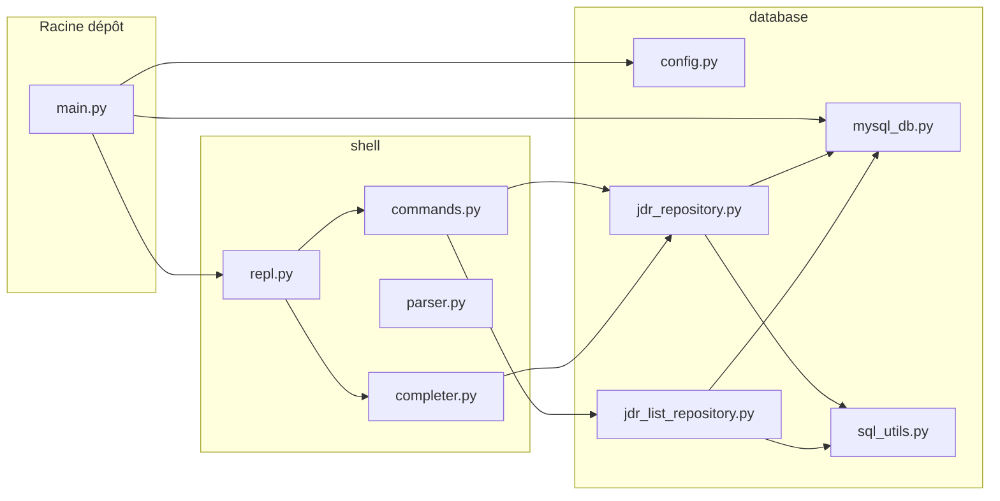
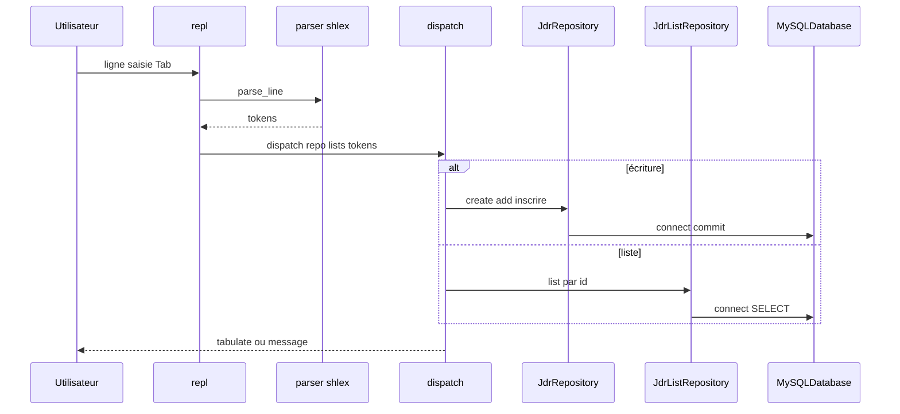
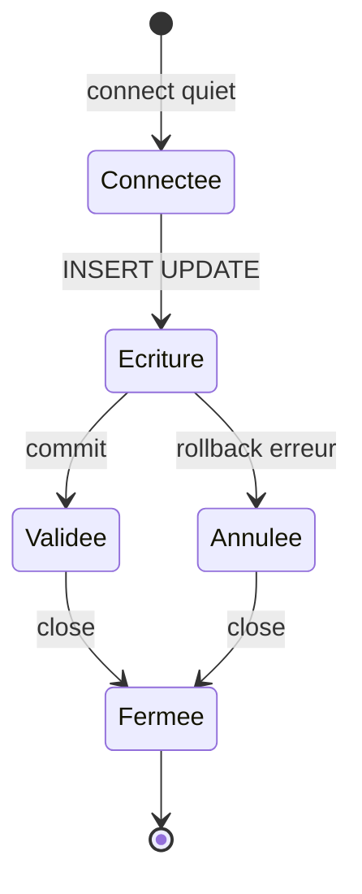

# Architecture

## Découpage des paquets Python

- **`main.py`** : point d’entrée Cyclopts, instancie `MySQLDatabase` et lance le shell.
- **`database`** : configuration, connexion, écritures (`JdrRepository`), lectures listes (`JdrListRepository`), utilitaires de lignes SQL (`sql_utils`).
- **`shell`** : boucle REPL (`prompt_toolkit`), dispatch des commandes, parsing `shlex`, complétion contextuelle.

## Flux d’une commande shell

## Connexions MySQL

Chaque méthode de dépôt ouvre une connexion, exécute la requête, valide ou annule la transaction, puis ferme la connexion. Le shell conserve **une** instance `MySQLDatabase` et **une** instance par dépôt pour toute la session ; ce n’est pas un pool partagé entre appels.

## Documentation MkDocs

Les pages sous `docs/` sont assemblées par **MkDocs** avec le thème **Material** et le plugin **mermaid2** pour les diagrammes.
