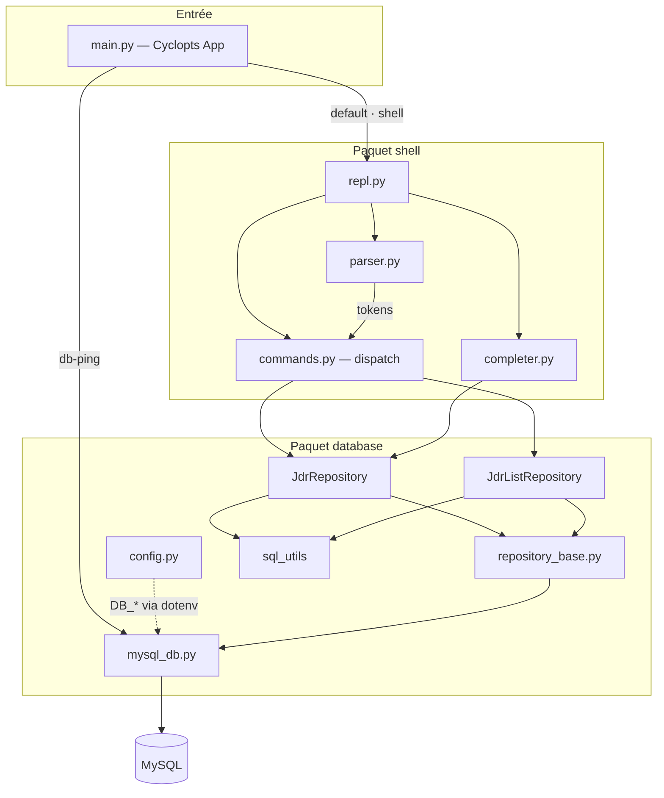
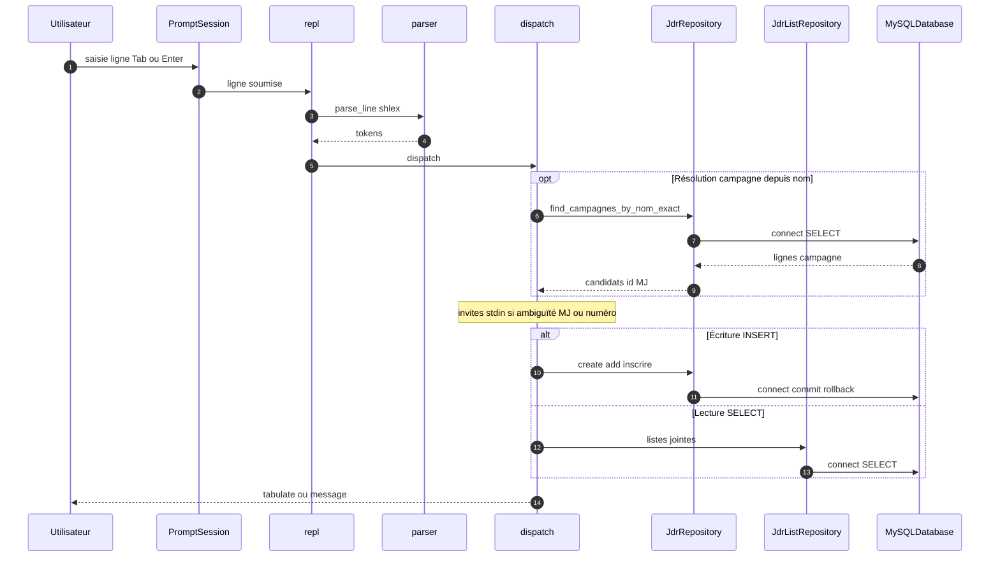
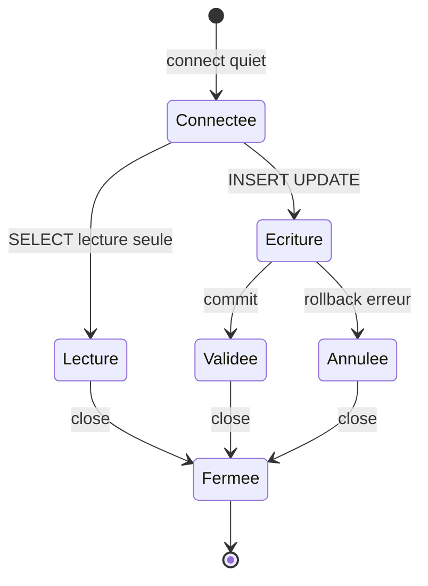

# Architecture

## Découpage des paquets Python

- **`main.py`** : point d’entrée Cyclopts ; `default_cmd` et `shell` lancent le REPL, `db-ping` interroge **`MySQLDatabase`** sans ouvrir le shell.
- **`database`** : configuration, connexion **`MySQLDatabase`**, socle commun **`BaseJdrRepository`** (fichier `repository_base.py`, détaillé dans [Modules Python](database/modules.md#repository_basepy)), écritures via **`JdrRepository`**, lectures listes via **`JdrListRepository`**, utilitaires **`sql_utils`**.
- **`shell`** : boucle REPL avec **`prompt_toolkit`**, dispatch des commandes, parsing `shlex`, complétion contextuelle.

## Flux d’une commande shell

## Connexions MySQL

Chaque méthode de dépôt ouvre une connexion via **`BaseJdrRepository._connection()`**, exécute la requête dans un bloc **`with self._session() as (conn, cur):`** qui garantit la fermeture du curseur et de la connexion, valide ou annule la transaction pour les écritures, puis termine. Le shell conserve **une** instance `MySQLDatabase` et **une** instance par dépôt pour toute la session ; ce n’est pas un pool partagé entre appels.

## Documentation MkDocs

Les pages sous `docs/` sont assemblées par **MkDocs** avec le thème **Material** et le plugin **mermaid2** pour les diagrammes.
