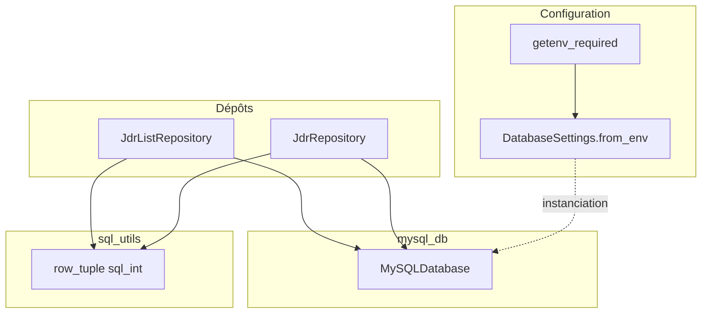

# Modules Python — paquet `database`

## Vue d’ensemble

## `config.py`

- Charge **`python-dotenv`** au chargement du module.
- **`DatabaseSettings`** : `host`, `user`, `password`, `database` construits depuis les variables `DB_*`.
- **`getenv_required`** : lève une erreur si une variable est absente ; le message d’erreur est en anglais.

## `mysql_db.py`

- **`MySQLDatabase`** : encapsule `mysql.connector.connect` avec le type de retour **`MySQLConnectionLike`**, union de **`PooledMySQLConnection`** et **`MySQLConnectionAbstract`**.
- **`connect(quiet=False)`** : en mode silencieux, pas de message console ; utilisé par les dépôts et le pré-contrôle shell.
- **`get_db_status()`** : `SELECT VERSION()` pour la commande CLI `db-ping`.

## `sql_utils.py`

- **`row_tuple`** / **`sql_int`** : adaptation des lignes renvoyées par le connecteur aux types attendus par **pyright**, pour des cellules SQL souvent typées de façon large.

## `jdr_repository.py` — écriture

| Méthode | Table |
|---------|--------|
| `create_campagne` | `campagne` |
| `add_personnage` | `personnage` |
| `create_quete` | `quete` |
| `inscrire_participation` | `participation` |
| `find_campagnes_by_nom_exact` | `campagne` — lecture des identifiants pour un `nom` exact |

Méthodes auxiliaires pour la **complétion** du shell : `list_campagnes`, listes distinctes `list_distinct_*`, `list_personnages`, `list_quetes` avec préfixe d’id.

**Résolution de campagne côté shell** : le shell appelle `find_campagnes_by_nom_exact(nom)`, qui renvoie la liste des couples id et `maitre_du_jeu` pour un **nom exact** de campagne. Plusieurs lignes sont possibles si le même `nom` existe pour des MJ différents, conformément à la contrainte d’unicité composite en base.

## `jdr_list_repository.py` — lectures structurées

Retours typés en **`NamedTuple`** :

| Méthode | Rôle |
|---------|------|
| `list_toutes_campagnes` | Toutes les campagnes, avec `date_creation` |
| `list_personnages_par_campagne` | Jointure `personnage` ⋈ `campagne` |
| `list_quetes_par_campagne` | Quêtes d’une campagne : titre, description, statut |
| `list_personnages_par_quete` | Jointure `participation` ⋈ `personnage` |
| `list_quetes_par_personnage` | Jointure `participation` ⋈ `quete` |

## Export public

Le paquet **`database`** réexporte les classes et types utiles via `database/__init__.py`. Voir ce fichier dans le dépôt pour la liste exacte.
