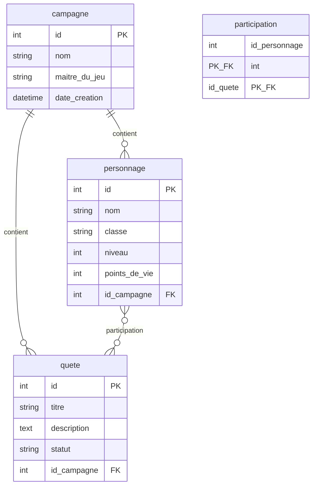
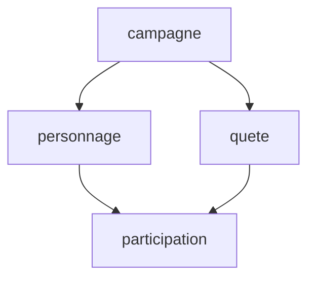

# Schéma relationnel

Le domaine métier repose sur **quatre tables** liées par des clés étrangères.

## Modèle entité-association

La table **`participation`** est une table de liaison **N:N** entre `personnage` et `quete`, à clé primaire composite.

!!! note "Unicité sur nom et maitre_du_jeu"
La contrainte **`UNIQUE (nom, maitre_du_jeu)`** sur `campagne` signifie qu’on ne peut pas identifier une campagne par le **seul** `nom` sans ambiguïté possible. Le shell permet néanmoins de saisir le **nom** : en cas d’homonymie, l’utilisateur est guidé pour choisir le bon enregistrement. Détails dans la page [Shell interactif](../application/shell.md).

## Ordre d’insertion recommandé

Les contraintes de clés étrangères imposent l’ordre suivant pour des **INSERT** cohérents :

1. **`campagne`** — aucune dépendance.
2. **`personnage`** et **`quete`** — tous deux référencent `id_campagne` ; l’ordre d’insertion entre ces deux tables est libre.
3. **`participation`** — exige un `id_personnage` et un `id_quete` existants.

Les listes avec jointures sont décrites dans [Modules Python](modules.md).
