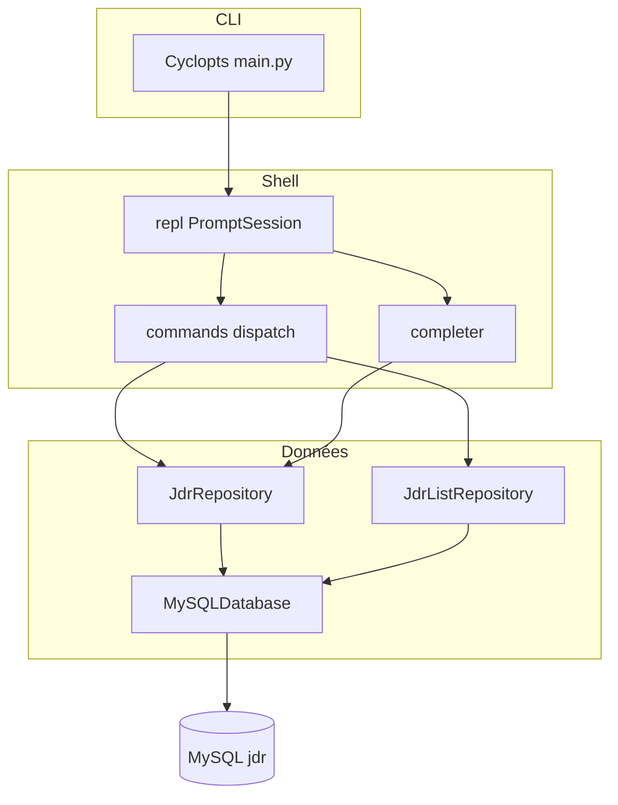

# exampy

**exampy** est une application Python en ligne de commande pour gérer une partie de **jeu de rôle (JDR)** : campagnes, personnages, quêtes et inscriptions (participations), avec persistance **MySQL** et un **shell interactif** (complétion Tab, historique).

## Fonctions principales

| Domaine | Rôle |
|---------|------|
| **CLI** | Entrée via [Cyclopts](application/cli.md) : shell par défaut, `db-ping` pour tester MySQL. |
| **Shell** | REPL `jdr>` : [création, listes et complétion](application/shell.md) branchées sur la base. |
| **Données** | [Schéma relationnel](database/schema.md) et [modules d’accès](database/modules.md) (`JdrRepository`, `JdrListRepository`). |

## Par où commencer

1. [Démarrage](demarrage.md) — environnement, `.env`, initialisation SQL, `uv run exampy`.
2. [Architecture](architecture.md) — vue d’ensemble et flux des composants.
3. [Shell interactif](application/shell.md) — référence des commandes.

## Schéma d’ensemble

